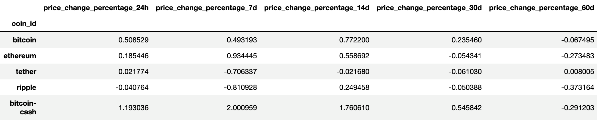
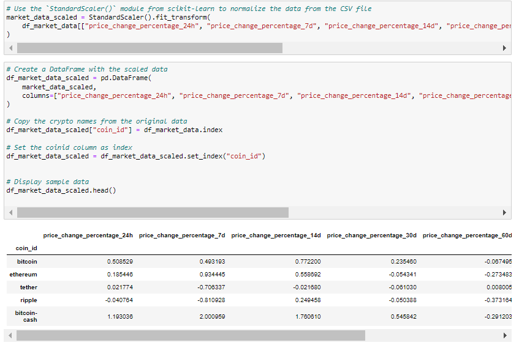
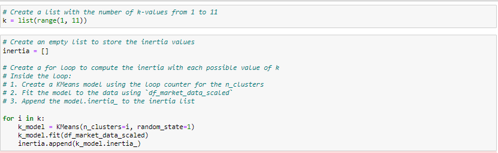
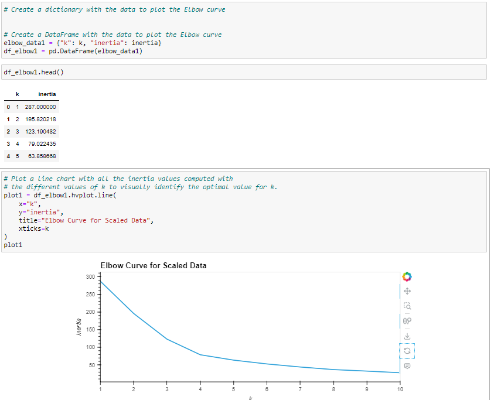
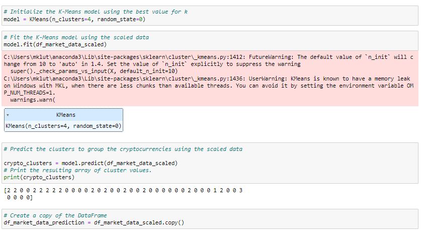
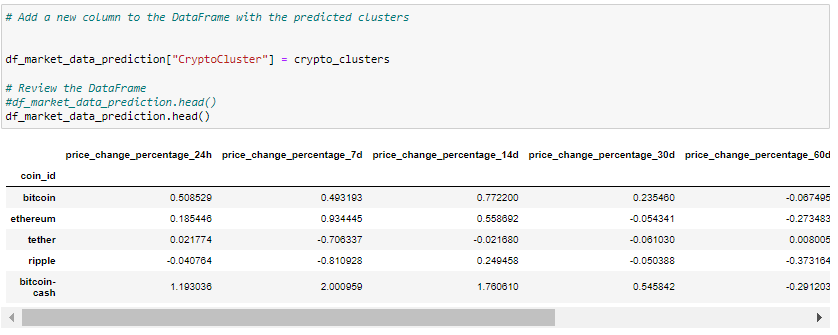
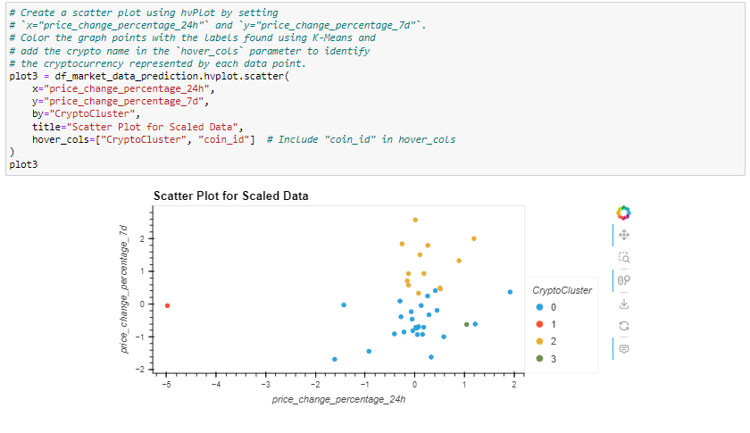

# Prepare the Data

Use the StandardScaler() module from scikit-learn to normalize the data from the CSV file.

Create a DataFrame with the scaled data and set the "coin_id" index from the original DataFrame as the index for the new DataFrame.

The first five rows of the scaled DataFrame should appear as follows:

# Find the Best Value for k Using the Original Scaled DataFrame

# Cluster the Cryptocurrencies with K-Means by Using the Original Data 

# Optimize the Clusters with Principal Component Analysis

# Find the Best Value for k by Using the PCA Data

# Cluster the Cryptocurrencies with K-means by Using the PCA Data 

# Visualize and Compare the Results

